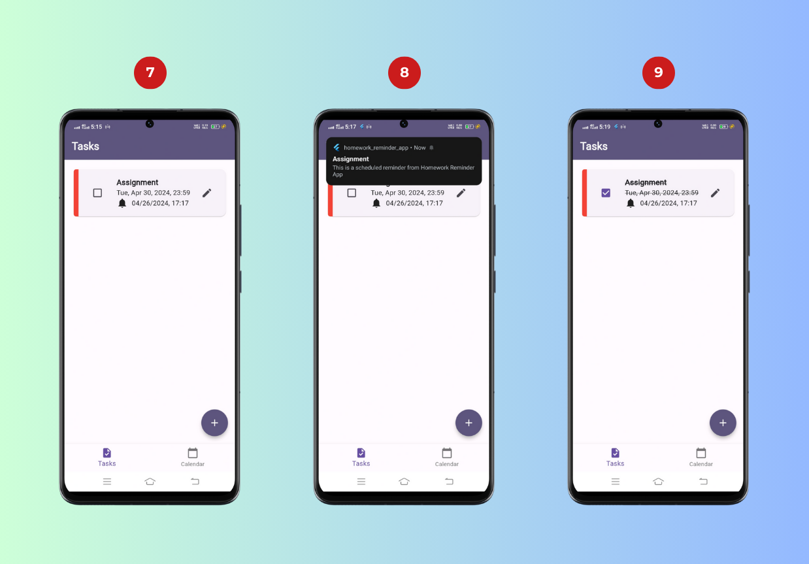

# Homework Reminder App

This project is one of my assignments that requires me to build an education app by using Flutter at the university.

## Getting Started

This project is a starting point for a Flutter application.

A few resources to get you started if this is your first Flutter project:

- [Lab: Write your first Flutter app](https://docs.flutter.dev/get-started/codelab)
- [Cookbook: Useful Flutter samples](https://docs.flutter.dev/cookbook)

For help getting started with Flutter development, view the
[online documentation](https://docs.flutter.dev/), which offers tutorials,
samples, guidance on mobile development, and a full API reference.

## Table of contents

- [Introduction](#introduction)
- [Purpose](#purpose)
- [Benefits](#benefits)
- [Functionality](#functionality)
- [Guideline](#guidelines)
- [Conclusion](#conclusion)
- [Test Application](#test-application)

## Introduction

The Homework Reminder App is an application that is specifically designed and built for students and allows them to manage their homework without missing the deadline.

By using this application, students are able to set reminders and deadlines to keep track of their homework, make sure that they don't miss any deadlines, and complete their homework on time to reduce stress and workload.

## Purpose

The purpose of creating this homework reminder app is specifically for students, which can help them:

- To prevent last-minute rushes to complete their homework

- Better manage their time and prioritize their homework accordingly

- Stay organized to reduce stress, and workload

## Benefits

The benefits for students of using this homework reminder app are:

- To keep track of their homework so they don't miss any deadlines

- Be able to complete their homework on time or before the deadline

## Functionality

1. Reminder Alerts

The app will send reminders and notifications to students, for which they have set reminders

2. Set Priority

Students can set priorities when creating the homework task to ensure that they focus on the most important homework first

3. Calendar Integration

App integrate with students' calendar allowing them to view their homework in calendar view

## Guideline

1. Once you have launched the app, you will be on the app's homepage. Click the "Get Started" button to move to the next page.

2. You will be on the Tasks page after clicking the "Get Started" button. To create a task, click the floating action button, which leads to the Add Task page.

3. The Add Task page has a few input fields that require users to input to create a task.

4. Once you have filled in all the required input fields, you will notice a change in the "Create" button from a disabled state to an enabled state. You can check the reminder checkbox to schedule a reminder. Otherwise, you can click the "Create" button to create a task.

5. If you have checked the reminder checkbox, it will appear with two input fields, the reminder date and time required to input for reminder, and the "Create" button will change from an enabled state to a disabled state.

6. Once you have filled in the reminder date and time, you can click "Create" button to create a task and return to previous page.

7. On the previous page, the Tasks page, a Task Card will appear after you have created a task.

8. The reminder notification will pop up based on you have set reminder date and time.

9. You can check the checkbox from the Task Card whenever you have finished their homework.

10. You can view the calendar by clicking the Calendar tab from the bottom navigation bar.

11. The Task Card will also appear based on you have set the due date.

## Conclusion

In summary, the Homework Reminder App will be an invaluable tool for students in managing their academic workload. Its features includes reminder alerts, priority setting, and calendar integration, enable efficient time management and task prioritization.

With this application, students can focus on learning and confidently pursue their academic goals.

## Test Application

Here is the [APK file](./build/app/outputs/flutter-apk/app-release.apk) for everyone to test the application. Feel free to test it.